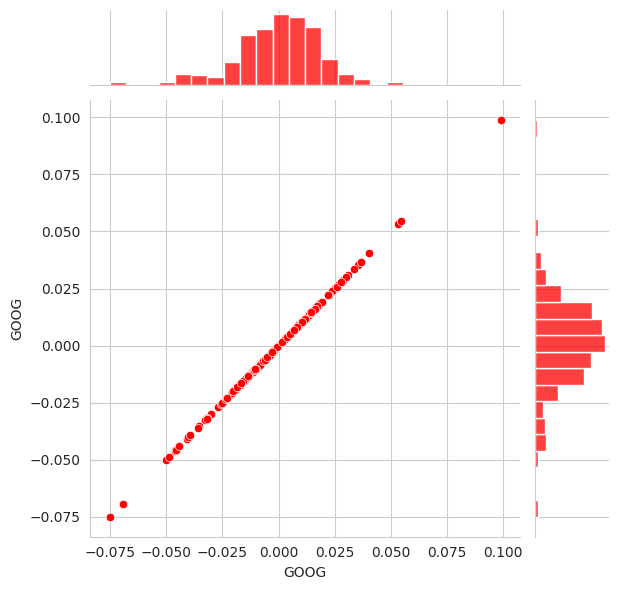
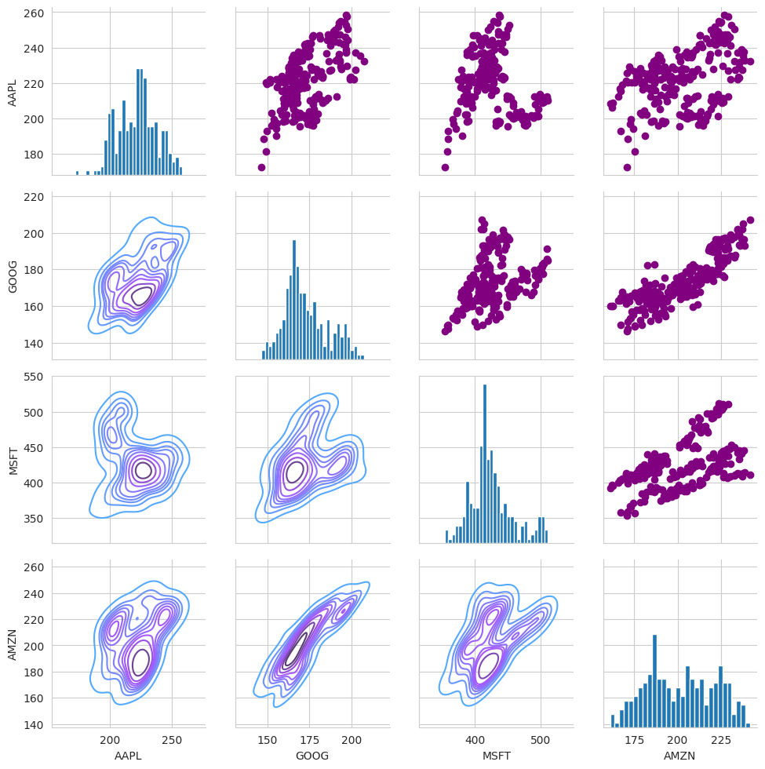
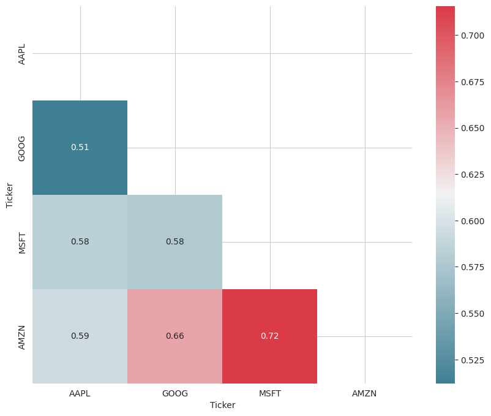
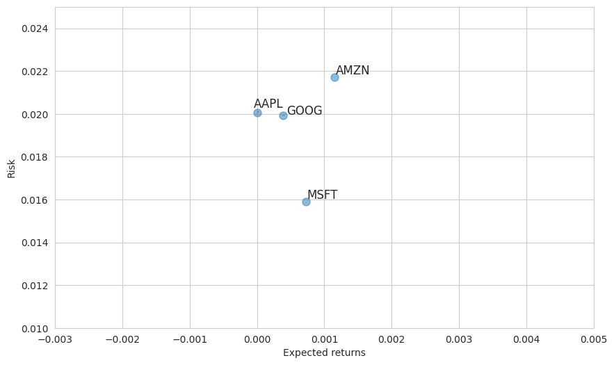
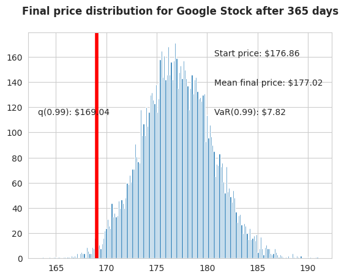

# `Stock Market Analysis and Risk Assessment`

This repository contains a Jupyter Notebook that performs a comprehensive analysis of major technology stocks (AAPL, GOOG, MSFT, AMZN). The analysis covers historical performance, volatility, correlation, and advanced risk assessment using Value at Risk (VaR) models.

The primary goal is to demonstrate a workflow for financial data analysis, from data acquisition and visualization to quantitative risk modeling.

---

## Project Overview

This project analyzes the stock performance of four major tech companies—Apple (AAPL), Google (GOOG), Microsoft (MSFT), and Amazon (AMZN)—over a one-year period. It leverages Python's data science stack to fetch, process, and visualize financial data, culminating in a risk assessment using both historical and Monte Carlo simulation methods.

  

---

## Key Analyses Performed

*   **Data Retrieval**: Fetches one year of historical stock data (Open, High, Low, Close, Volume) using the `yfinance` library.
*   **Time Series Visualization**: Plots the closing price and trading volume over time to identify trends and periods of high activity.
*   **Technical Analysis**: Calculates and plots Simple Moving Averages to smooth out price data and identify trend directions.
*   **Volatility Analysis**: Computes and visualizes daily percentage returns to analyze the stock's volatility and risk profile.
*   **Comparative Analysis**:
    *   **Pair Plots**: Visualizes the pairwise relationships and distributions of daily returns between all stocks in the portfolio.
    *   **Correlation Heatmap**: Quantifies the correlation between the daily returns of the stocks.
*   **Risk-Return Tradeoff**: Plots the expected return against the risk for each stock.
*   **Value at Risk (VaR) Modeling**:
    *   **Historical Method**: Calculates the 5% historical VaR.
    *   **Monte Carlo Simulation**: Models future stock prices to estimate the 1% VaR.

---

## Methodology

### Moving Averages (MA)
A Moving Average is a core technical analysis indicator that smooths out price action by filtering out short-term fluctuations, or "noise."

*   **What it is**: It's the average price of a stock over a specific number of periods ($N$). The formula for a Simple Moving Average (SMA) is:

    SMAt = (1/N) × Σ(Pt-i) for i = 0 to N-1

    where Pt is the price at time t, and N is the number of periods.

*   **Why it's used**: MAs help identify the overall trend direction. When a short-term MA crosses above a long-term MA, it can signal a bullish trend (a "golden cross"). The reverse can signal a bearish trend (a "death cross").

### Daily Return Analysis
Instead of analyzing absolute prices, we often analyze daily returns, calculated as the percentage change in price from one day to the next.

*   **What it is**: The daily return $R_t$ at time $t$ is calculated as:

    **Rt = (Pt - Pt-1) / Pt-1**

    where Pt is the closing price on day t and Pt-1 is the closing price on the previous day.

*   **Why it's used**:
    1.  **Normalization**: Returns are normalized and allow for the comparison of stocks with different price levels.
    2.  **Stationarity**: Price series are often non-stationary, whereas return series are typically stationary, making them more suitable for statistical modeling.
    3.  **Risk Measurement**: The distribution and standard deviation of daily returns are direct measures of a stock's volatility and risk.

### Correlation & Pair Plots
Understanding how stocks move in relation to each other is critical for portfolio diversification.

*   **Pair Plot**: A matrix of plots that visualizes the relationship between each pair of variables.
*   **Correlation Heatmap**: A graphical representation of the correlation matrix. It quantifies the strength of the linear relationship between stock returns using the correlation coefficient, $\rho$, where $-1 \le \rho \le 1$.

### Risk-Return Analysis
This is a fundamental concept in finance. The analysis plots the expected return (mean of daily returns, $E[R]$) against the risk (standard deviation of daily returns, $\sigma$).

*   **Interpretation**:
    *   **Higher on Y-axis**: Higher risk/volatility ($\sigma$).
    *   **Higher on X-axis**: Higher average daily return ($E[R]$).
    *   This plot helps investors visualize the tradeoff they are making between potential rewards and risk.

### Value at Risk (VaR)
VaR is a statistical measure that quantifies the level of financial risk within a firm or portfolio over a specific time frame. It answers the question: "What is the maximum loss I can expect with a certain level of confidence over a given period?"

1.  **Historical VaR (Bootstrap Method)**
    *   **How it works**: This non-parametric method assumes that history will repeat itself. It arranges the historical daily returns from worst to best and identifies the threshold at which a certain percentage of losses fall. For a 95% confidence level, we find the 5th percentile of historical returns.

2.  **Monte Carlo VaR**
    *   **How it works**: This is a forward-looking, model-based approach. We simulate thousands of possible future price paths using a simplified discrete-time model of Geometric Brownian Motion. The price at the next time step ($P_t$) is calculated from the current price ($P_{t-1}$) using the stock's historical mean daily return ($\mu$) and standard deviation ($\sigma$). The formula used in this notebook's simulation is:

        **Pt = Pt-1 × (1 + μΔt + σε√Δt)**

        Where:
        - Δt is the time step (in this case, 1 day)
        - μ is the average daily return (drift)
        - σ is the standard deviation of daily returns (volatility)
        - ε is a random variable sampled from a standard normal distribution, ε ~ N(0, 1)

    *   The distribution of the final prices from all simulations gives a range of potential outcomes. VaR is then calculated as a percentile (e.g., the 1st percentile for 99% confidence) of this simulated distribution.

---

## Visualizations

| **Correlation and Distribution of Daily Returns** | **Correlation Heatmap** |
|:---:|:---:|
|  |  |
| **Risk vs. Return Analysis** | **Monte Carlo Simulation for VaR** |
|  |  |

---

